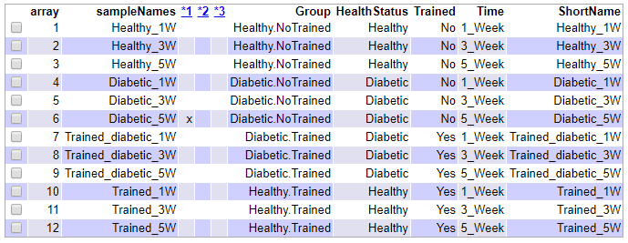
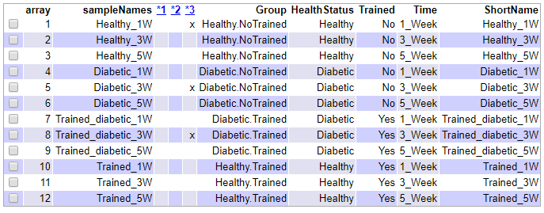

## __PEC 1: MICROARRAY ANALYSIS OF GEO:GSE1659  "Time series of diabetes and exercise training induced expression changes in skeletal muscle of mice"__ 

#### *RESULTADOS*
````{r include = FALSE}
library("knitr")
library("colorspace")
library("gplots")
library("ggplot2")
library("ggrepel")
library("htmlTable")
library("prettydoc")
library("devtools")
library("BiocManager")
library("oligo")
library("arrayQualityMetrics")
library("pvca")
library("limma")
library("dplyr")
library("genefilter")
library("annotate")
library("org.Mm.eg.db")
library("ReactomePA")
library("reactome.db")
````

#### *PASO 1: Preparación de los datos*

```{r echo=FALSE}
#setwd(".")
#setwd("D:/BIOESTADÍSTICA-INFORMÁTICA/Análisis de datos ómicos/data")
#dir.create("data")
#dir.create("results")
targets=read.csv(paste(getwd(),"/targets.csv", sep = ""),header=TRUE,sep=";") #Cargamos los datos del fichero targets.csv
targets
knitr::kable(targets, booktabs = TRUE, caption = 'Content of the targets file used for the current analysis') #Ahora podemos ver en una tabla todas las muestras de microarray junto a sus atributos. También tenemos la columna "ShortName", que contiene los nombres con los cuales podremos identificar cada muestra en todos los análisis que realicemos.
```

##### Cargamos los ficheros .CEL y leemos los datos. Al final de este paso tendremos las intensidades "raw" guardadas en rawData. 
````{r echo=FALSE}
library(oligo)
celFiles = list.celfiles(paste(getwd(),"/data", sep = ""), full.names = TRUE)
library(Biobase)
require(Biobase)
#Ahora vamos a asociar la información almacenada en los archivos CEL con el archivo "targets"
myTargets <- read.AnnotatedDataFrame(paste(getwd(),"/targets.csv", sep = ""), header = TRUE, row.names = 1, sep=";")
#Ahora tenemos los datos crudos "raw"
rawData = read.celfiles(celFiles, phenoData = myTargets) 
print(pData(rawData))
````

````{r include = FALSE}
#Nombramos las muestras con el ShortName
colnames(rawData) = myTargets@data$ShortName
head(rawData)
````

#### *PASO 2: Control de calidad*

##### Histograma con rawData
````{r echo = FALSE}
ShortName<-rawData$ShortName
hist(rawData, main = "Signal distribution", col = c(rep("red", 3), rep("blue", 3), rep("green", 3), rep("yellow", 3)))
legend (x="topright", legend=ShortName, fill = c(rep("red", 3), rep("blue", 3), rep("green", 3), rep("yellow", 3)))
````

````{r include = FALSE}
png("hist_RawData.png", width = 20, height = 12,
     units = "cm", res = 600, pointsize = 10)
hist(rawData, main = "Signal distribution", col = c(rep("red", 3), rep("blue", 3), rep("green", 3), rep("yellow", 3)))
legend (x="topright", legend=ShortName, fill = c(rep("red", 3), rep("blue", 3), rep("green", 3), rep("yellow", 3)))
dev.off()
````

##### Diagrama de cajas y bigotes con rawData
````{r echo = FALSE}
boxplot(rawData, cex.axis=0.5, las=2, which="all",
col = c(rep("red", 3), rep("blue", 3), rep("green", 3), rep("yellow", 3)),
main="Distribution of raw intensity values")
````

````{r include = FALSE}
png("boxplot_RawData.png", width = 20, height = 12,
     units = "cm", res = 600, pointsize = 10)
boxplot(rawData, cex.axis=0.5, las=2, which="all",
col = c(rep("red", 3), rep("blue", 3), rep("green", 3), rep("yellow", 3)),
main="Distribution of raw intensity values")
dev.off()
````

##### Análisis de Componentes Principales (PCA) con rawData
````{r echo = FALSE}
library(ggplot2)
library(ggrepel)
plotPCA3 <- function (datos, labels, factor, title, scale,colores, size = 1.5, glineas = 0.25) {
data <- prcomp(t(datos),scale=scale)
# plot adjustments
dataDf <- data.frame(data$x)
Group <- factor
loads <- round(data$sdev^2/sum(data$sdev^2)*100,1)
# main plot
p1 <- ggplot(dataDf,aes(x=PC1, y=PC2)) +
theme_classic() +
geom_hline(yintercept = 0, color = "gray70") +
geom_vline(xintercept = 0, color = "gray70") +
geom_point(aes(color = Group), alpha = 0.55, size = 3) +
coord_cartesian(xlim = c(min(data$x[,1])-5,max(data$x[,1])+5)) +
scale_fill_discrete(name = "Group")
# avoiding labels superposition
p1 + geom_text_repel(aes(y = PC2 + 0.25, label = labels),segment.size = 0.25, size = size) + 
labs(x = c(paste("PC1",loads[1],"%")),y=c(paste("PC2",loads[2],"%"))) + ggtitle(paste("Principal Component Analysis for: ",title,sep=" "))+ 
theme(plot.title = element_text(hjust = 0.5)) +
scale_color_manual(values=colores)
}
plotPCA3(exprs(rawData), labels = targets$ShortName, factor = targets$Group,  title="Raw data", scale = FALSE, size = 3, colores = c("red", "blue","green","yellow"))
````

````{r include = FALSE}
png("PCA_RawData.png", width = 20, height = 12,
     units = "cm", res = 600, pointsize = 10)
plotPCA3 <- function (datos, labels, factor, title, scale,colores, size = 1.5, glineas = 0.25) {
data <- prcomp(t(datos),scale=scale)
# plot adjustments
dataDf <- data.frame(data$x)
Group <- factor
loads <- round(data$sdev^2/sum(data$sdev^2)*100,1)
# main plot
p1 <- ggplot(dataDf,aes(x=PC1, y=PC2)) +
theme_classic() +
geom_hline(yintercept = 0, color = "gray70") +
geom_vline(xintercept = 0, color = "gray70") +
geom_point(aes(color = Group), alpha = 0.55, size = 3) +
coord_cartesian(xlim = c(min(data$x[,1])-5,max(data$x[,1])+5)) +
scale_fill_discrete(name = "Group")
# avoiding labels superposition
p1 + geom_text_repel(aes(y = PC2 + 0.25, label = labels),segment.size = 0.25, size = size) + 
labs(x = c(paste("PC1",loads[1],"%")),y=c(paste("PC2",loads[2],"%"))) + ggtitle(paste("Principal Component Analysis for: ",title,sep=" "))+ 
theme(plot.title = element_text(hjust = 0.5)) +
scale_color_manual(values=colores)
}
plotPCA3(exprs(rawData), labels = targets$ShortName, factor = targets$Group,  title="Raw data", scale = FALSE, size = 3, colores = c("red", "blue","green","yellow"))
dev.off()
````

##### Clúster jerárquico con rawData
````{r echo = FALSE}
hc <- hclust(dist(t(exprs(rawData))),method="average")
plot(hc, labels=ShortName, hang=-1, main="Hierarchical clustering of samples")
````

````{r include = FALSE}
png("Cluster_RawData.png", width = 20, height = 12,
     units = "cm", res = 600, pointsize = 10)
plot(hc, labels=ShortName, hang=-1, main="Hierarchical clustering of samples")
dev.off()
````

##### Finalmente, utilizamos la libreria "arrayQualityMetrics" para generar un informe de la calidad de nuestras muestras. Este informe llamado "index.html" se ha generado en la carpeta Results/QCDir.Norm 
`````{r include = FALSE}
library(arrayQualityMetrics)
arrayQualityMetrics(rawData, outdir = "./Results/rawData_quality", force = T)
````

````{r echo = FALSE}}
# 
````



#### *PASO 3: Normalización y control de calidad de datos normalizados*

##### Normalización de las muestras por el método RMA
````{r include = FALSE}
eset_rma<-rma(rawData)
````

##### Sacamos de nuevo el informe de calidad pero con nuestras muestras normalizadas. 
````{r include = FALSE}
arrayQualityMetrics(eset_rma, outdir = file.path("./results", "QCDir.Norm"), force=TRUE)
````

````{r}
# 
````



##### Diagrama de cajas y bigotes con los datos normalizados
````{r echo = FALSE}
boxplot(eset_rma, cex.axis=0.5, las=2,  which="all", col = c(rep("red", 3), rep("blue", 3), rep("green", 3), rep("yellow", 3)), main="Boxplot for arrays intensity: Normalized Data")
````

````{r include = FALSE}
png("Boxplot_normData.png", width = 20, height = 12,
     units = "cm", res = 600, pointsize = 10)
boxplot(eset_rma, cex.axis=0.5, las=2,  which="all", col = c(rep("red", 3), rep("blue", 3), rep("green", 3), rep("yellow", 3)), main="Boxplot for arrays intensity: Normalized Data")
dev.off()
````

##### Análisis de componentes principales con los datos normalizados
````{r echo = FALSE}
plotPCA3(exprs(eset_rma), labels = targets$ShortName, factor = targets$Group, title="Normalized data", scale = FALSE, size = 3,  colores = c("red", "blue", "green", "yellow"))
````

````{r include = FALSE}
png("PCA_NormData.png", width = 20, height = 12,
     units = "cm", res = 600, pointsize = 10)
PCA_NormData<-plotPCA3(exprs(eset_rma), labels = targets$ShortName, factor = targets$Group, title="Normalized data", scale = FALSE, size = 3,  colores = c("red", "blue", "green", "yellow"))
PCA_NormData
dev.off()
````

#### *PASO 4: Detección de efectos derivados del "batch"*

##### Principal Variance Component Analysis (PVCA) para buscar efectos producidos por el "batch"
````{r echo  = FALSE}
library(pvca)
pData(eset_rma) <- targets
#select the threshold
pct_threshold <- 0.6
#select the factors to analyze
batch.factors <- c("HealthStatus", "Trained","Time")
#run the analysis
pvcaObj <- pvcaBatchAssess (eset_rma, batch.factors, pct_threshold)
````

````{r echo = FALSE}
bp <- barplot(pvcaObj$dat, xlab = "Effects",
ylab = "Weighted average proportion variance",
ylim= c(0,1.1),col = c("mediumorchid"), las=2,
main="PVCA estimation")
axis(1, at = bp, labels = pvcaObj$label, cex.axis = 0.55, las=2)
values = pvcaObj$dat
new_values = round(values , 3)
text(bp,pvcaObj$dat,labels = new_values, pos=3, cex = 0.5)
````

````{r include = FALSE}
png("PVCA_estimation.png", width = 20, height = 12,
     units = "cm", res = 600, pointsize = 10)
bp <- barplot(pvcaObj$dat, xlab = "Effects",
ylab = "Weighted average proportion variance",
ylim= c(0,1.1),col = c("mediumorchid"), las=2,
main="PVCA estimation")
axis(1, at = bp, labels = pvcaObj$label, cex.axis = 0.55, las=2)
values = pvcaObj$dat
new_values = round(values , 3)
text(bp,pvcaObj$dat,labels = new_values, pos=3, cex = 0.5)
dev.off()
````

#### *PASO 5: Detección de los genes más y menos variables y filtraje* 

##### Genes más variables entre muestras con una desviación estándar superior al 90-95%.
````{r echo = FALSE}
sds <- apply (exprs(eset_rma), 1, sd)
sdsO<- sort(sds)
plot(1:length(sdsO), sdsO, main="Distribution of variability for all genes", sub="Vertical lines represent 90% and 95% percentiles", xlab="Gene index (from least to most variable)", ylab="Standard deviation")
abline(v=length(sds)*c(0.9,0.95))
````

````{r include = FALSE}
png("Var_genes.png", width = 20, height = 12,
     units = "cm", res = 600, pointsize = 10)
plot(1:length(sdsO), sdsO, main="Distribution of variability for all genes", sub="Vertical lines represent 90% and 95% percentiles", xlab="Gene index (from least to most variable)", ylab="Standard deviation")
abline(v=length(sds)*c(0.9,0.95))
dev.off()
````

##### Filtraje de aquellos genes cuya variabilidad es posible atribuirla a la variación aleatoria más que a diferencias entre situaciones de nuestro experimento. El umbral de variabilidad es de 0.75. Anotación de los datos de microarray: "mgu74av2.db". 
````{r echo = FALSE}
library(genefilter)
library(mgu74av2.db)
annotation(eset_rma) <- "mgu74av2.db"
filtered <- nsFilter(eset_rma, require.entrez = TRUE, remove.dupEntrez = TRUE, var.filter=TRUE, var.func=IQR, var.cutoff=0.75, filterByQuantile=TRUE, feature.exclude = "^AFFX")
print(filtered$filter.log)
eset_filtered <-filtered$eset
````

##### Nos hemos quedado con 2176 genes después del filtrado para analizar. Ahora guardamos los datos normalizados y filtrados:
```{r echo = FALSE}
library("readr")
write.csv(exprs(eset_rma), file="./results/normalized.Data.csv")

write.csv(exprs(eset_filtered), file="./results/normalized.Filtered.Data.csv")
save(eset_rma, eset_filtered, file="./results/normalized.Data.Rda")
```

#### *PASO 6: Matriz de diseño y matriz de contraste*

````{r echo = FALSE}
if (!exists("eset_filtered")) load (file="./results/normalized.Data.Rda")
````

##### Matriz de diseño: 12 filas (1 por cada muestra) y 4 columnas ya que hemos considerado nuestro experimento como un experimento con un solo factor y cuatro niveles.  
````{r echo = FALSE}
library(limma)
designMat<- model.matrix(~0+Group, pData(eset_filtered))
colnames(designMat) <- c("Diabetic.NoTrained", "Diabetic.Trained", "Healthy.NoTrained", "Healthy.Trained")
print(designMat)
````

##### Matriz de contrastes. Teniendo en cuenta los objetivos de este trabajo, los contrastes que se realizarán son los siguientes: (1) Ratón sano vs sano con entrenamiento, (2) Ratón diabético vs ratón sano, (3) Ratón diabético con entrenamiento vs ratón sano, (4) Ratón diabético entrenado vs ratón diabético y (5) La interacción entre estado de salud y entrenamiento ("INT").
````{r echo = FALSE}
cont.matrix <- makeContrasts (TrainedvsNoTrained.Healthy = Healthy.Trained-Healthy.NoTrained, DiabeticvsControl.NoTrained = Diabetic.NoTrained-Healthy.NoTrained, DiabeticTrainedvsControl = Diabetic.Trained-Healthy.NoTrained, TrainedcvsNoTrained.Diabetic = Diabetic.Trained-Diabetic.NoTrained, INT = (Diabetic.Trained-Healthy.Trained) - (Diabetic.NoTrained-Healthy.NoTrained), levels=designMat)
print(cont.matrix)
````

#### *PASO 7: Selección de genes diferencialmente expresados* 

##### Se utilizarán modelos de Bayes empíricos para combinar la información de la matriz y los genes y mejorar así las estimaciones del error. Asimismo, se utilizará el método de Benjamini-Hochberg para ajustar los p-valores obtenidos de forma que se pueda controlar la tasa de falsos positivos.
````{r echo = FALSE}
library(limma)
fit<-lmFit(eset_filtered, designMat)
fit.main<-contrasts.fit(fit, cont.matrix)
fit.main<-eBayes(fit.main)
class(fit.main) 
````

##### Genes diferencialmente expresados en cada una de las comparaciones ordenados de más a menos diferencialmente expresados. Se mostrarán los 5 genes más diferencialmente expresados con sus correspondientes valores de logFoldChange (logFC), expresión media (AveExpr), valor t, p-valor, p-valor ajustado, valor B:

##### Comparación 1: Ratón sano vs sano con entrenamiento
````{r echo = FALSE}
topHealthy.TrainedvsHealthy.NoTrained <- topTable (fit.main, number=nrow(fit.main), coef="TrainedvsNoTrained.Healthy", adjust="fdr")

head(topHealthy.TrainedvsHealthy.NoTrained, 5) #Genes más diferencialmente expresados
````

##### Comparación 2: Ratón diabético vs sano
````{r echo = FALSE}
topDiabetic.NoTrainedvsHealthy.NoTrained <- topTable (fit.main, number=nrow(fit.main), coef="DiabeticvsControl.NoTrained", adjust="fdr")

head(topDiabetic.NoTrainedvsHealthy.NoTrained, 5) #Genes más diferencialmente expresados
````

##### Comparación 3: Ratón diabético con entrenamiento vs ratón sano
````{r echo = FALSE}
topDiabetic.TrainedvsHealthy.NoTrained <- topTable (fit.main, number=nrow(fit.main), coef="DiabeticTrainedvsControl", adjust="fdr")

head(topDiabetic.TrainedvsHealthy.NoTrained, 5) #Genes más diferencialmente expresados
````

##### Comparación 4: Ratón diabético entrenado vs ratón diabético
````{r echo = FALSE}
topDiabetic.TrainedvsDiabetic.NoTrained <- topTable (fit.main, number=nrow(fit.main), coef="TrainedcvsNoTrained.Diabetic", adjust="fdr")

head(topDiabetic.TrainedvsDiabetic.NoTrained, 5)
````
   
##### Comparación 5: Interacción
````{r echo = FALSE}
topTab_INT  <- topTable (fit.main, number=nrow(fit.main), coef="INT", adjust="fdr") 

head(topTab_INT, 5)
````

##### Como podemos observar, la primera columna de las tablas obtenidas en las cinco comparaciones corresponde al ID de cada conjunto de sondas de Affymetrix. Para poder conocer los genes diferencialmente expresados necesitamos conocer qué gen corresponde a cada ID (anotación).
````{r echo = FALSE}
annotatedTopTable <- function(topTab, anotPackage)
{
topTab <- cbind(PROBEID=rownames(topTab), topTab)
myProbes <- rownames(topTab)
thePackage <- eval(parse(text = anotPackage))
geneAnots <- select(thePackage, myProbes, c("SYMBOL", "ENTREZID", "GENENAME"))
annotatedTopTab<- merge(x=geneAnots, y=topTab, by.x="PROBEID", by.y="PROBEID")
return(annotatedTopTab)
}
````

````{r echo = FALSE}
topAnnotated_HealthyTrainedvsHealthy.NoTrained<- annotatedTopTable(topHealthy.TrainedvsHealthy.NoTrained, anotPackage="mgu74av2.db")
topAnnotated_Diabetic.NoTrainedvsHealthy.NoTrained<- annotatedTopTable(topDiabetic.NoTrainedvsHealthy.NoTrained, anotPackage="mgu74av2.db")
topAnnotated_Diabetic.TrainedvsHealthy.NoTrained<- annotatedTopTable(topDiabetic.TrainedvsHealthy.NoTrained, anotPackage="mgu74av2.db")
topAnnotated_Diabetic.TrainedvsDiabetic.NoTrained<- annotatedTopTable(topDiabetic.TrainedvsDiabetic.NoTrained, anotPackage="mgu74av2.db")
topAnnotated_INT<- annotatedTopTable(topTab_INT, anotPackage="mgu74av2.db")
````

````{r echo = FALSE}
write.csv(topAnnotated_HealthyTrainedvsHealthy.NoTrained, file="./results/topAnnotated_HealthyTrainedvsHealthy.NoTrained.csv")
write.csv(topAnnotated_Diabetic.NoTrainedvsHealthy.NoTrained, file="./results/topAnnotated_Diabetic.NoTrainedvsHealthy.NoTrained.csv")
write.csv(topAnnotated_Diabetic.TrainedvsHealthy.NoTrained, file="./results/topAnnotated_Diabetic.TrainedvsHealthy.NoTrained.csv")
write.csv(topAnnotated_Diabetic.TrainedvsDiabetic.NoTrained, file="./results/topAnnotated_Diabetic.TrainedvsDiabetic.NoTrained.csv")
write.csv(topAnnotated_INT, file="./results/topAnnotated_INT.csv")
````

````{r echo = FALSE}
head(topAnnotated_HealthyTrainedvsHealthy.NoTrained)
head(topAnnotated_Diabetic.NoTrainedvsHealthy.NoTrained)
head(topAnnotated_Diabetic.TrainedvsHealthy.NoTrained)
head(topAnnotated_Diabetic.TrainedvsDiabetic.NoTrained)
head(topAnnotated_INT)
````

##### *Volcano plots*
   
##### Volcano plot con los top 5 genes más diferencialmente expresados en la comparación 1: Ratón sano vs sano con entrenamiento. 
````{r echo = FALSE}
library("mgu74av2.db")
geneSymbols <- select(mgu74av2.db, rownames(fit.main), c("SYMBOL"))
SYMBOLS<- geneSymbols$SYMBOL
volcanoplot(fit.main, coef=1, highlight=5, names=SYMBOLS, 
main=paste("Differentially expressed genes", colnames(cont.matrix)[1], sep="\n"))
abline(v=c(-1,1))
````

````{r include = FALSE}
png("Volcano_c1.png", width = 20, height = 12,
     units = "cm", res = 600, pointsize = 10)
geneSymbols <- select(mgu74av2.db, rownames(fit.main), c("SYMBOL"))
SYMBOLS<- geneSymbols$SYMBOL
volcanoplot(fit.main, coef=1, highlight=5, names=SYMBOLS, 
main=paste("Differentially expressed genes", colnames(cont.matrix)[1], sep="\n"))
abline(v=c(-1,1))
dev.off()
````

##### Volcano plot con los top 5 genes más diferencialmente expresados en la comparación 2: Ratón diabético vs sano. 
````{r echo = FALSE}
geneSymbols <- select(mgu74av2.db, rownames(fit.main), c("SYMBOL"))
SYMBOLS<- geneSymbols$SYMBOL
volcanoplot(fit.main, coef=2, highlight=5, names=SYMBOLS, 
main=paste("Differentially expressed genes", colnames(cont.matrix)[2], sep="\n"))
abline(v=c(-1,1))
````
````{r include = FALSE}
png("Volcano_c2.png", width = 20, height = 12,
     units = "cm", res = 600, pointsize = 10)
geneSymbols <- select(mgu74av2.db, rownames(fit.main), c("SYMBOL"))
SYMBOLS<- geneSymbols$SYMBOL
volcanoplot(fit.main, coef=2, highlight=5, names=SYMBOLS, 
main=paste("Differentially expressed genes", colnames(cont.matrix)[2], sep="\n"))
abline(v=c(-1,1))
dev.off()
````

##### Volcano plot con los top 5 genes más diferencialmente expresados en la comparación 3: Ratón diabético con entrenamiento vs ratón sano.
````{r echo = FALSE}
geneSymbols <- select(mgu74av2.db, rownames(fit.main), c("SYMBOL"))
SYMBOLS<- geneSymbols$SYMBOL
volcanoplot(fit.main, coef=3, highlight=5, names=SYMBOLS, 
main=paste("Differentially expressed genes", colnames(cont.matrix)[3], sep="\n"))
abline(v=c(-1,1))
````

````{r include = FALSE}
png("Volcano_c3.png", width = 20, height = 12,
     units = "cm", res = 600, pointsize = 10)
geneSymbols <- select(mgu74av2.db, rownames(fit.main), c("SYMBOL"))
SYMBOLS<- geneSymbols$SYMBOL
volcanoplot(fit.main, coef=3, highlight=5, names=SYMBOLS, 
main=paste("Differentially expressed genes", colnames(cont.matrix)[3], sep="\n"))
abline(v=c(-1,1))
dev.off()
````

##### Volcano plot con los top 5 genes más diferencialmente expresados en la comparación 4: Ratón diabético con entrenamiento vs ratón diabético sin entrenamiento. 
````{r echo = FALSE}
geneSymbols <- select(mgu74av2.db, rownames(fit.main), c("SYMBOL"))
SYMBOLS<- geneSymbols$SYMBOL
volcanoplot(fit.main, coef=4, highlight=5, names=SYMBOLS, 
main=paste("Differentially expressed genes", colnames(cont.matrix)[4], sep="\n"))
abline(v=c(-1,1))
````

````{r include = FALSE}
png("Volcano_c4.png", width = 20, height = 12,
     units = "cm", res = 600, pointsize = 10)
geneSymbols <- select(mgu74av2.db, rownames(fit.main), c("SYMBOL"))
SYMBOLS<- geneSymbols$SYMBOL
volcanoplot(fit.main, coef=4, highlight=5, names=SYMBOLS, 
main=paste("Differentially expressed genes", colnames(cont.matrix)[4], sep="\n"))
abline(v=c(-1,1))
dev.off()
````

##### Volcano plot con los top 5 genes más diferencialmente expresados cuando estudiamos la interacción.  
````{r echo = FALSE}
geneSymbols <- select(mgu74av2.db, rownames(fit.main), c("SYMBOL"))
SYMBOLS<- geneSymbols$SYMBOL
volcanoplot(fit.main, coef=5, highlight=5, names=SYMBOLS, 
main=paste("Differentially expressed genes", colnames(cont.matrix)[5], sep="\n"))
abline(v=c(-1,1))
````

````{r include = FALSE}
png("Volcano_c5.png", width = 20, height = 12,
     units = "cm", res = 600, pointsize = 10)
geneSymbols <- select(mgu74av2.db, rownames(fit.main), c("SYMBOL"))
SYMBOLS<- geneSymbols$SYMBOL
volcanoplot(fit.main, coef=5, highlight=5, names=SYMBOLS, 
main=paste("Differentially expressed genes", colnames(cont.matrix)[5], sep="\n"))
abline(v=c(-1,1))
dev.off()
````

##### Comparaciones múltiples y diagrama de Venn*

##### Vamos a estudiar qué genes están up-regulados y down-regulados en cada una de las comparaciones. Estos genes se muestran a continuación:
````{r echo = FALSE}
library(limma)
res<-decideTests(fit.main, method="separate", adjust.method="fdr", p.value=0.1, lfc=1)
sum.res.rows<-apply(abs(res),1,sum)
res.selected<-res[sum.res.rows!=0,] 
print(summary(res))
````

##### Diagrama de Venn los genes diferencialmente expresados en común entre las 4 categorías con FDR < 0.1 y logFC > 1.
```{r echo = FALSE}
vennDiagram (res.selected[,1:4], cex=0.90)
title("Genes  diferencialmente expresados en las 4 categorías (FDR < 0.1 y logFC > 1)")
```

````{r include = FALSE}
png("VennDiag.png", width = 20, height = 12,
     units = "cm", res = 600, pointsize = 10)
vennDiagram (res.selected[,1:4], cex=0.90)
title("Genes  diferencialmente expresados en las 4 categorías (FDR < 0.1 y logFC > 1)")
dev.off()
````

##### *3.7.3. Visualización de los perfiles de expresión usando mapas de calor "Heatmaps"*

##### Heatmap sin ningún tipo de agrupación de muestras. A la derecha podemos ver el listado de los genes que se encuentran up/downregulados.
````{r echo = FALSE}
probesInHeatmap <- rownames(res.selected)
HMdata <- exprs(eset_filtered)[rownames(exprs(eset_filtered)) %in% probesInHeatmap,]
geneSymbols <- select(mgu74av2.db, rownames(HMdata), c("SYMBOL"))
SYMBOLS<- geneSymbols$SYMBOL
rownames(HMdata) <- SYMBOLS
write.csv(HMdata, file = file.path("./results/data4Heatmap.csv"))

my_palette <- colorRampPalette(c("blue", "red"))(n = 299)
library(gplots)
heatmap.2(HMdata,
Rowv = FALSE,
Colv = FALSE,
main = "Differentially expressed genes \n FDR <0,1, logFC >=1",
scale = "row",
col = my_palette,
sepcolor = "white",
sepwidth = c(0.05,0.05),
cexRow = 0.5,
cexCol = 0.9,
key = TRUE,
keysize = 1.5,
density.info = "histogram",
ColSideColors = c(rep("red",3),rep("blue",3), rep("green",3), rep("yellow",3)),
tracecol = NULL,
dendrogram = "none",
srtCol = 30)
````

`````{r include = FALSE}
png("Heatmap.png", width = 20, height = 12,
     units = "cm", res = 600, pointsize = 10)
heatmap.2(HMdata,
Rowv = FALSE,
Colv = FALSE,
main = "Differentially expressed genes \n FDR <0,1, logFC >=1",
scale = "row",
col = my_palette,
sepcolor = "white",
sepwidth = c(0.05,0.05),
cexRow = 0.5,
cexCol = 0.9,
key = TRUE,
keysize = 1.5,
density.info = "histogram",
ColSideColors = c(rep("red",3),rep("blue",3), rep("green",3), rep("yellow",3)),
tracecol = NULL,
dendrogram = "none",
srtCol = 30)
dev.off()
````

##### Heatmap con dos tipos de agrupamientos: arriba estaría la agrupación entre muestras (columnas) y a la izquierda la agrupación por genes (filas). 
````{r echo = FALSE}
heatmap.2(HMdata,
Rowv = TRUE,
Colv = TRUE,
dendrogram = "both",
main = "Differentially expressed genes \n FDR < 0,1, logFC >=1",
scale = "row",
col = my_palette,
sepcolor = "white",
sepwidth = c(0.05,0.05),
cexRow = 0.5,
cexCol = 0.9,
key = TRUE,
keysize = 1.5,
density.info = "histogram",
ColSideColors = c(rep("red",3),rep("blue",3), rep("green",3), rep("yellow",3)),
tracecol = NULL,
srtCol = 30)
````

````{r include = FALSE}
png("Heatmap_Dendo.png", width = 20, height = 12,
     units = "cm", res = 600, pointsize = 10)
heatmap.2(HMdata,
Rowv = TRUE,
Colv = TRUE,
dendrogram = "both",
main = "Differentially expressed genes \n FDR < 0,1, logFC >=1",
scale = "row",
col = my_palette,
sepcolor = "white",
sepwidth = c(0.05,0.05),
cexRow = 0.5,
cexCol = 0.9,
key = TRUE,
keysize = 1.5,
density.info = "histogram",
ColSideColors = c(rep("red",3),rep("blue",3), rep("green",3), rep("yellow",3)),
tracecol = NULL,
srtCol = 30)
dev.off()
````

#### *PASO 8: Análisis de significación biológica*

````{r echo = FALSE}
listOfTables <- list(TrainedvsNoTrained.Healthy = topHealthy.TrainedvsHealthy.NoTrained,  DiabeticvsControl.NoTrained  = topDiabetic.NoTrainedvsHealthy.NoTrained, DiabeticTrainedvsControl = topDiabetic.TrainedvsHealthy.NoTrained, TrainedcvsNoTrained.Diabetic = topDiabetic.TrainedvsDiabetic.NoTrained, INT = topTab_INT)
listOfSelected <- list()
for (i in 1:length(listOfTables)){
# select the toptable
topTab <- listOfTables[[i]]
# select the genes to be included in the analysis
whichGenes<-topTab["adj.P.Val"]<0.15
selectedIDs <- rownames(topTab)[whichGenes]
# convert the ID to Entrez
EntrezIDs<- select(mgu74av2.db, selectedIDs, c("ENTREZID"))
EntrezIDs <- EntrezIDs$ENTREZID
listOfSelected[[i]] <- EntrezIDs
names(listOfSelected)[i] <- names(listOfTables)[i]
}
sapply(listOfSelected, length)
````

````{r echo = FALSE}
mapped_genes2GO <- mappedkeys(org.Mm.egGO)
mapped_genes2KEGG <- mappedkeys(org.Mm.egPATH)
mapped_genes <- union(mapped_genes2GO , mapped_genes2KEGG)
````

##### Análisis de significación biológica para las cuatro comparaciones: GO terms y red de interacción
```{r echo = FALSE}
listOfData <- listOfSelected[1:3]
comparisonsNames <- names(listOfData)
universe <- mapped_genes

for (i in 1:3){
genesIn <- listOfData[[i]]
comparison <- comparisonsNames[i]
enrich.result <- enrichPathway(gene = genesIn,
pvalueCutoff = 0.05,
readable = T,
pAdjustMethod = "BH",
organism = "mouse",
universe = universe)
cat("##################################")
cat("\nComparison: ", comparison,"\n")
print(head(enrich.result))
if (length(rownames(enrich.result@result)) != 0) {
write.csv(as.data.frame(enrich.result), 
file =paste0("./results/","ReactomePA.Results.",comparison,".csv"), 
row.names = FALSE)
pdf(file=paste0("./results/","ReactomePABarplot.",comparison,".pdf"))
print(barplot(enrich.result, showCategory = 15, font.size = 4, 
title = paste0("Reactome Pathway Analysis for ", comparison,". Barplot")))
dev.off()
 
pdf(file = paste0("./results/","ReactomePAcnetplot.",comparison,".pdf"))
print(cnetplot(enrich.result, categorySize = "geneNum", schowCategory = 15, 
vertex.label.cex = 0.75))
dev.off()
}
}
````

##### Red de interación génica
````{r echo = FALSE}
cnetplot(enrich.result, categorySize = "geneNum", schowCategory = 15, 
vertex.label.cex = 0.75)
````

````{r include = FALSE}
png("Enrichr_red.png", width = 20, height = 12,
     units = "cm", res = 600, pointsize = 10)
cnetplot(enrich.result, categorySize = "geneNum", schowCategory = 15, 
vertex.label.cex = 0.75)
dev.off()
````
